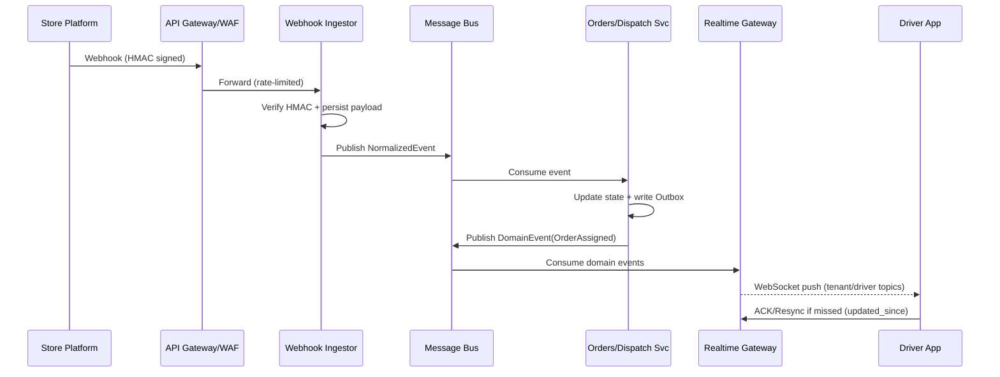
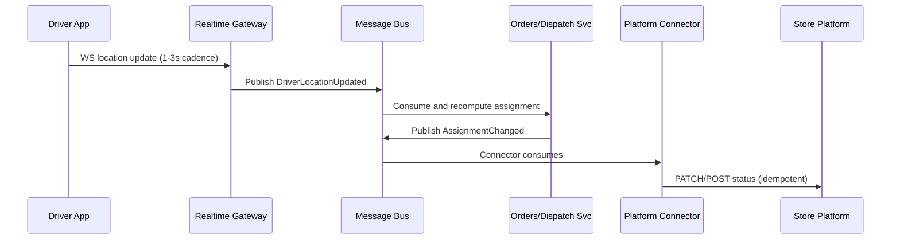

# Pilot X – Q3 System Design: Reliability & Scaling

**Scope:** Support secure inbound API/webhook traffic from 30+ e‑commerce platforms and real‑time dispatch updates to ~50 concurrent drivers (scales beyond). This document captures an implementation‑ready architecture, service choices, sequence diagrams, SLOs, and ops playbooks.

---

## 1) Executive Overview

* **Goals:**

  * Ingest store events securely at the edge with strict validation and rate controls.
  * Normalize events, persist reliably, and publish on an internal message bus.
  * Drive dispatch logic and push updates to mobile/web clients in near real time.
  * Degrade gracefully when any external integration (e.g., Shopify) is degraded.
* **Non‑Goals:** Detailed mobile UI, billing, or ETL warehouse modeling.

**Key patterns:** API Gateway + WAF at the edge, stateless microservices on Kubernetes, PostgreSQL as source of truth with Outbox, Redis for cache and presence, Kafka or NATS JetStream as the event backbone, WebSocket/MQTT realtime gateway, per‑integration circuit breakers, DLQs, and runbooks.

---

## 2) Container (C2) Diagram – High‑Level

```mermaid
flowchart LR
  subgraph External
    Store1[Shopify] ---|Webhook/API| APIGW
    StoreN[Other Stores] ---|Webhook/API| APIGW
    Admin[Ops Console (Web)] ---|HTTPS| APIGW
    DriverApps[Driver Mobile Apps] ---|WS/HTTPS| RealtimeGW
  end

  subgraph Edge
    APIGW[API Gateway + WAF + Rate Limit]
    RealtimeGW[Realtime Gateway (WebSocket/MQTT)]
  end

  subgraph Core[Core Services (Kubernetes)]
    Auth[AuthN/Z (OIDC, JWT, HMAC)]
    OrderSvc[Orders & Dispatch Service]
    IntegrationHub[Integration Hub]
    ConnShopify[Connector: Shopify]
    ConnWoo[Connector: Woo/Magento/...]
    WebhookIngest[Webhook Ingestor]
    Outbox[Transaction Outbox Worker]
    Orchestrator[Saga/Orchestration]
  end

  subgraph Data[Data & Infra]
    PG[(PostgreSQL)]
    Redis[(Redis Cache/Rate Limit/Presence)]
    MQ[(Kafka or NATS JetStream)]
    DLQ[(Dead Letter Queue)]
    Obj[(Object Storage)]
    Search[(OpenSearch/Elasticsearch)]
    TS[(ClickHouse/Timescale – optional)]
  end

  APIGW --> Auth
  APIGW --> WebhookIngest
  APIGW --> OrderSvc
  WebhookIngest --> MQ
  ConnShopify <--> IntegrationHub
  ConnWoo <--> IntegrationHub
  IntegrationHub <--> MQ
  OrderSvc <--> MQ
  OrderSvc <--> PG
  OrderSvc <--> Redis
  Outbox --> MQ
  MQ -->|events| RealtimeGW
  MQ --> Orchestrator
  RealtimeGW --> DriverApps
  Orchestrator --> PG
  MQ --> DLQ
  APIGW --> Search
  APIGW --> Obj
```

---

## 3) Data & Infra Choices (with rationale)

### Databases

* **PostgreSQL** (managed; e.g., RDS/Cloud SQL):

  * Strong relational model for multi‑tenant transactional data (orders, drivers, assignments).
  * Row‑Level Security (RLS) for tenant isolation.
  * Logical replication or CDC for downstream analytics without touching OLTP.

### Caching

* **Redis**:

  * **Hot data**: active orders by tenant, driver presence/location snapshots, websocket session state.
  * **Distributed locks**: use sparingly for idempotent sections (avoid over‑locking).
  * **Rate limiting**: token bucket keys per tenant/api.

### Message Bus

* **Kafka** if you want replay, large fan‑out, and durable history; partition by tenant for isolation.
* **NATS JetStream** if you want lean ops and low‑latency pub/sub with at‑least‑once and per‑subject streams.
* **Dead Letter Queues** per connector for poison messages; include error context for replay tools.

### Search / Observability Storage

* **OpenSearch/Elasticsearch** for ad‑hoc ops queries (not a source of truth).
* **Object Storage** for payload archives (e.g., large webhooks, POD photos).
* **ClickHouse/Timescale** optional for time‑series metrics (driver heatmaps, SLA curves).

---

## 4) Security Posture

* **Edge:** API Gateway + WAF, TLS 1.2+, strict body size limits, IP allowlists for known store ranges where available.
* **Webhook auth:** HMAC signature verification per platform; reject on clock skew or signature mismatch.
* **Drivers/Admin:** OAuth2/OIDC; short‑lived JWT access tokens, refresh flow; JWKS rotation.
* **Service‑to‑service:** mTLS inside the cluster, least‑privilege network policies.
* **Secrets:** Vault/ASM; never in env files. Rotations automated.
* **Auditing:** Append‑only `events` table for sensitive state changes.

---

## 5) Core Patterns

### 5.1 Transactional Outbox

* On business write (e.g., order assignment), commit state **and** an `outbox` row in a single DB transaction.
* A worker publishes outbox rows to MQ with idempotent keys; marks rows published.
* Guarantees no lost events even if services crash between DB and MQ.

### 5.2 Idempotency

* Inbound: de‑dupe on `(platform, external_id, event_id)`; store checksum.
* Outbound: idempotency keys in headers to external APIs; dedupe window 24–72h.

### 5.3 Backpressure & Isolation

* Separate topics/subjects per integration and per tenant.
* Bulkheads: distinct worker pools so one slow integration can’t starve the rest.

### 5.4 Circuit Breaking & Retries

* Client libraries with exponential backoff + jitter, bounded retries.
* Open circuit after error/latency thresholds; backoff probes for recovery.

---

## 6) Real‑Time Dispatch Flow

### Sequence: Inbound Store Update → Driver Update



### Sequence: Driver Location → Assignment Change → Store Sync



---

## 7) Fault Tolerance When a Platform Is Down (e.g., Shopify)

* **Detect quickly:** error rate SLI, p95 latency, and health checks per connector.
* **Isolate impact:** per‑platform topics and worker pools; open circuit to fail fast.
* **Queue and replay:** continued internal operation; events for that platform go to its DLQ after bounded retries.
* **Graceful degradation:**

  * UI banner: “Shopify sync delayed since <timestamp>”.
  * Keep dispatch logic running on **internal** state; accept new orders via other channels.
  * Background sync resumes automatically once probes succeed; operators can trigger replay from DLQ.
* **Runbook:** see Appendix A.

---

## 8) Sizing & Scaling Notes

* **Driver connections:** 50 concurrent is trivial for a single realtime pod; design for 5k to be safe. Use HPA on active WS connections and publish lag.
* **Throughput targets (initial):**

  * Webhook ingest: 200 RPS sustained, 1k burst (elastic).
  * End‑to‑end p99 for dispatch updates: < 500 ms inside cluster.
* **Kubernetes:** HPA on CPU/RPS/queue lag; PDBs; multi‑AZ nodes; rolling with maxUnavailable=0 for realtime.

---

## 9) Service/Tech Stack

* **Language/Framework:** NestJS (TypeScript) for API, WebSocket, and connectors; Go is an option for the Realtime gateway.
* **API Gateway:** Kong/NGINX Ingress or AWS API Gateway + WAF.
* **Message Bus:** Kafka (MSK) or NATS JetStream (managed where available).
* **DB:** PostgreSQL (RDS/Cloud SQL) with read replicas; PITR enabled.
* **Cache:** Redis (Elasticache/Redis Cloud) with separate logical DBs for rate limits vs cache.
* **Observability:** OpenTelemetry → Prometheus + Grafana; Loki for logs; SLO dashboards per integration.
* **CI/CD:** GitHub Actions; blue‑green or canary; schema migrations via Prisma/TypeORM.
* **IaC:** Terraform + Helm.

---

## 10) API & Auth Details (Edge)

* **Webhook endpoints:** one per platform version where needed; strict schemas; reject unknown fields where it’s safe.
* **Validation:** clock‑skew window ±5 min; constant‑time HMAC compare; idempotency key header support.
* **Tenant scoping:** `x-tenant-id` mapped from API key; RLS enforces isolation in DB and topic naming in MQ.

---

## 11) Data Model (skim)

* `tenants(id, …)`
* `stores(id, tenant_id, platform, credentials_secret_ref, …)`
* `orders(id, tenant_id, external_ref, status, pickup, dropoff, …)`
* `assignments(id, order_id, driver_id, status, …)`
* `drivers(id, tenant_id, status, last_seen_at, …)`
* `events(id, type, entity_id, payload, created_at)`
* `outbox(id, event_type, payload, aggregate_id, published_at)`

All multi‑tenant tables include `tenant_id` and use RLS.

---

## 12) AWS/GCP Mappings (example AWS)

* **API Gateway & WAF** → Amazon API Gateway + AWS WAF.
* **Kubernetes** → EKS; ALB Ingress Controller.
* **Message Bus** → MSK (Kafka) or Amazon MQ (if NATS is self‑managed).
* **DB** → Amazon RDS for PostgreSQL.
* **Cache** → ElastiCache for Redis.
* **Object Storage** → S3.
* **Search** → OpenSearch Service.
* **Observability** → Managed Prometheus/Grafana or self‑hosted; CloudWatch for infra.
* **Secrets** → AWS Secrets Manager.

---

## 13) SLOs & Alerts

* **Availability:** 99.9% for Core API; 99.5% per external integration (varies by vendor SLO).
* **Latency:** p99 internal event propagation < 500 ms; p95 webhook ack < 100 ms.
* **Error budget policy:** alert on burn rate > 2x over 1h; page on > 4x over 15m.
* **Connector health:** alert thresholds on 5xx rate and queue lag per platform.

---

## 14) Operational Runbooks

### Appendix A – Shopify Outage Playbook (extract)

1. **Confirm:** spike in 5xx, open circuit breaker; tag incident `shopify-outage`.
2. **Stabilize:** pause non‑critical sync tasks; ensure DLQ capacity; keep ingesting other platforms.
3. **Communicate:** in‑app banner for affected tenants; status page update.
4. **Mitigate:** throttle retries with exponential backoff + jitter; snapshot backlog size.
5. **Recover:** detect green probes; drain DLQ with bounded concurrency; monitor lag and store rate.
6. **Post‑mortem:** timings, backlog, replay duration; update thresholds if needed.

---

## 15) ADRs (Architecture Decision Records)

### ADR‑0001 – Message Bus (Kafka vs NATS)

**Context:** We need durable pub/sub, fan‑out, and optional replay.
**Options:** Kafka (durable log, replay, ecosystem) vs NATS JetStream (simplicity, low latency).
**Decision:** Start with **Kafka** via MSK for durability/replay and ecosystem tooling.
**Consequences:** Heavier ops footprint but strong guarantees and analytics flexibility.

### ADR‑0002 – Realtime Protocol (WebSocket vs MQTT vs SSE)

**Context:** Mobile drivers need duplex messaging, background support, and fan‑out.
**Options:** WebSocket, MQTT over WebSocket, SSE.
**Decision:** **WebSocket** with optional MQTT sub‑protocol for QoS and topic semantics.
**Consequences:** Stateful connections; scale gateway by connection count and publish lag.

### ADR‑0003 – DB as Source of Truth (PostgreSQL + Outbox)

**Context:** Avoid dual‑write bugs and lost events.
**Decision:** PostgreSQL for OLTP with Transactional Outbox; MQ is derived state.
**Consequences:** Slightly more complexity (outbox worker), but robust exactly‑once effects.

---

## 16) Developer Notes

* Keep diagrams/versioned docs in `/docs/architecture/` with Mermaid source alongside PNG export.
* Establish a small set of domain events (`OrderCreated`, `OrderAssigned`, `DriverLocationUpdated`, `AssignmentChanged`, `DeliveryCompleted`).
* Provide a DLQ replay admin UI with filters by tenant/date/platform.
* Use feature flags for connector rollouts and canary by tenant.

---

## 17) Glossary

* **Bulkhead:** Resource isolation so one failing component can’t drown others.
* **Circuit breaker:** Fails fast after repeated errors to protect upstream/downstream.
* **DLQ:** Dead Letter Queue for messages that can’t be processed automatically.
* **Outbox:** Pattern to publish events reliably after DB commits.
* **RLS:** Row‑Level Security to enforce multi‑tenant isolation in SQL.

---

**End of pack.**
